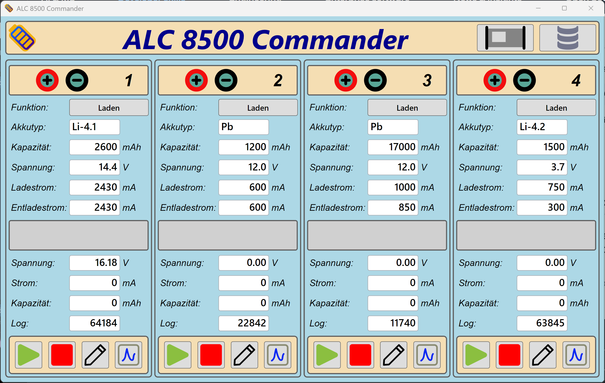
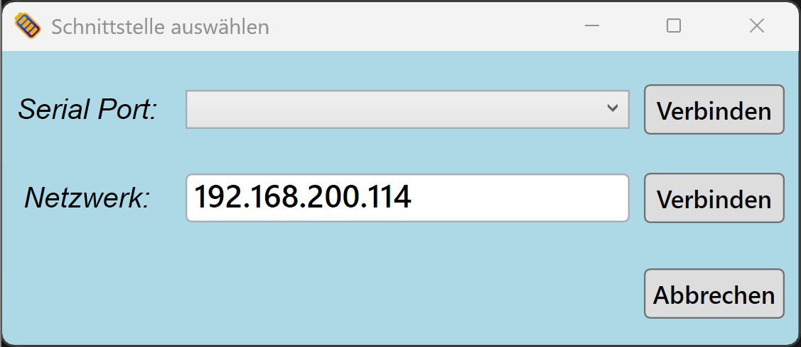
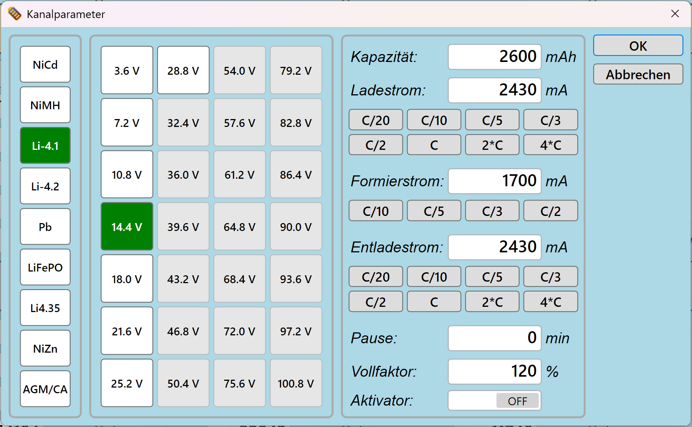
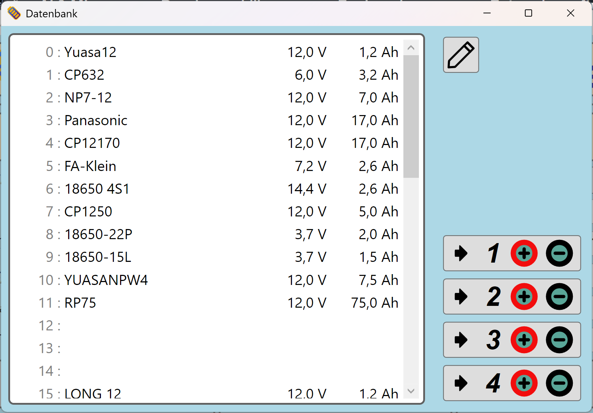
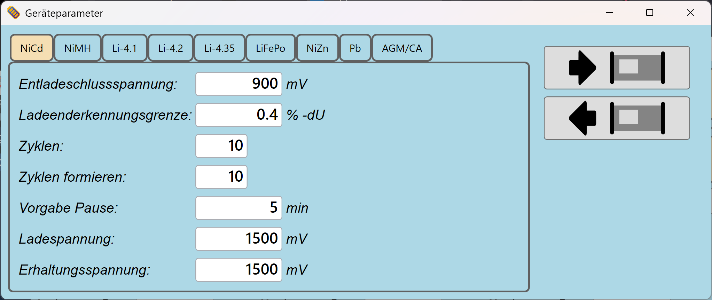

# ALC 8500 Commander

**PC-Software zur Steuerung und Überwachung des Ladegeräts ALC 8500 Expert**

Das ALC 8500 Expert ist ein professionelles 4-Kanal-Ladegerät für nahezu alle gängigen Akkutypen. Der *ALC 8500 Commander* verbindet sich über USB (Serial Port) oder Netzwerk mit dem Gerät und ermöglicht eine komfortable Bedienung am PC – inklusive Akkudatenbank, Parameterprofile und Ladeprotokoll-Visualisierung.

---

## Screenshots

### Hauptfenster
Das Hauptfenster zeigt alle vier aktiven Kanäle auf einen Blick. Für jeden Kanal sind Akkutyp, Kapazität, Spannung, Lade- und Entladestrom sowie Echtzeitdaten sichtbar. Über die Schaltflächen am unteren Rand lässt sich ein Kanal starten, stoppen, konfigurieren oder das Ladeprotokoll anzeigen.



---

### Verbindung herstellen
Beim Start wählt man den Verbindungsweg: entweder über einen **Serial Port** (USB) oder per **Netzwerk-IP**. Die zuletzt verwendete IP-Adresse wird gespeichert.



Für Netzwerkverbindungen wird die vorhandene USB-Schnittstelle durch einen W5500-EVB-Pico ersetzt, der das Übertragungsprotokoll über eine TCP/IP-Verbindung tunnelt. Dieses Projekt ist noch in Arbeit.

---

### Kanal konfigurieren
Im Konfigurationsfenster legt man alle Parameter für einen Kanal fest:
- **Akkutyp** (NiCd, NiMH, Li-4.1, Li-4.2, Li-4.35, LiFePO, NiZn, Pb, AGM/CA)
- **Nennspannung** – alle sinnvollen Spannungsstufen werden zur Auswahl angeboten
- **Kapazität**, **Ladestrom**, **Formierstrom**, **Entladestrom** – jeweils mit C-Rate-Schnellauswahl
- **Pause**, **Vollfaktor**, **Aktivator**



---

### Akkudatenbank
Häufig verwendete Akkus lassen sich in einer Datenbank speichern und per Knopfdruck einem Kanal zuweisen. Die Einträge enthalten Name, Nennspannung und Kapazität.



---

### Geräteparameter
Die geräteseitigen Parameter (Entladeschlussspannung, Ladeenderkennungsgrenze, Zyklen, Pause, Lade- und Erhaltungsspannung) können je Akkutyp direkt vom PC aus gelesen und geschrieben werden.



---

## Funktionen im Überblick

| Funktion | Beschreibung |
|---|---|
| Verbindung | USB (Serial Port) oder TCP/IP |
| Kanalüberwachung | Spannung, Strom, Kapazität in Echtzeit |
| Akkudatenbank | Speichern und Abrufen von Akkuprofilen |
| Kanalparameter | Vollständige Konfiguration aller Ladeparameter |
| Geräteparameter | Lesen und Schreiben der geräteseitigen Einstellungen |
| Ladeprotokoll | Visualisierung des Spannungs-/Stromverlaufs |

---

## Unterstützte Akkutypen

NiCd · NiMH · Li-Ion (4,1 V / 4,2 V / 4,35 V) · LiFePO₄ · NiZn · Pb (AGM/CA)

---

## Voraussetzungen

- Windows 10 oder neuer
- .NET Framework 4.8 
- ALC 8500 Expert mit USB- oder Netzwerk-Schnittstelle

---

## Installation

1. Die aktuelle Version unter [Releases](../../releases) herunterladen
2. ZIP entpacken
3. `ALC8500Commander.exe` starten

Eine Installation ist nicht erforderlich.

---

## Aus dem Quellcode bauen

```bash
git clone https://github.com/DEIN-USERNAME/alc8500-commander.git
cd alc8500-commander
dotnet build
```

---

## Kompatibilität

Die Software wurde entwickelt und getestet mit dem **ALC 8500 Expert**. Andere Geräte der ALC-8500-Familie könnten kompatibel sein, wurden aber nicht gezielt getestet.

---

## Haftungsausschluss

Diese Software wird **ohne jegliche Gewährleistung** bereitgestellt – weder ausdrücklich noch stillschweigend. Die Nutzung erfolgt auf eigene Gefahr.

Der Autor übernimmt **keine Haftung** für Schäden jeglicher Art, die durch den Einsatz dieser Software entstehen könnten, einschließlich, aber nicht beschränkt auf:

- Beschädigung oder Zerstörung von Akkus oder Ladegeräten
- Datenverlust oder fehlerhafte Konfigurationen
- Folgeschäden durch Fehlfunktionen der Software oder der Hardware

Es liegt in der **Verantwortung des Nutzers**, die eingestellten Parameter (Spannung, Strom, Kapazität, Akkutyp) vor dem Starten eines Ladevorgangs sorgfältig zu prüfen. Die Software ersetzt nicht das Lesen und Verstehen der Bedienungsanleitung des Ladegeräts.

---

## Lizenz

Noch nicht festgelegt. Bis zur Festlegung gilt: Alle Rechte vorbehalten.
